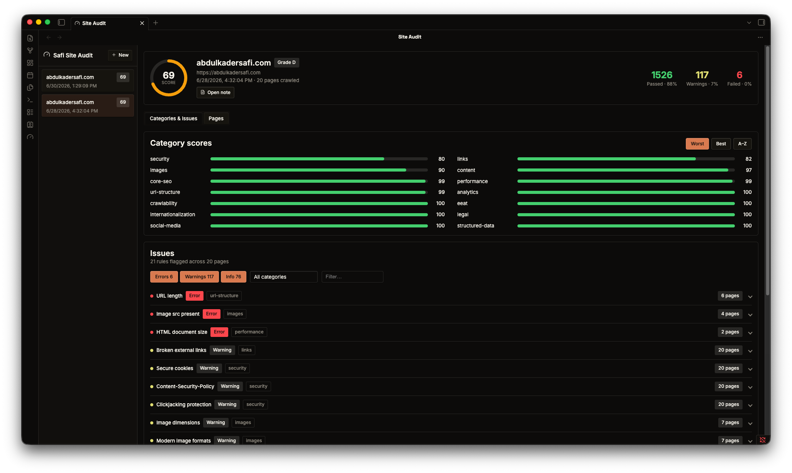

# Safi Site Audit

An Obsidian plugin that runs website audits from inside your vault and saves each one as a
Markdown note. It wraps the [Safi-Studio-Scanner](https://github.com/Abdulkader-Safi/Safi-Studio-Scanner)
engine, which scores a site across SEO, content, links, images, structured data, security,
crawlability and more.



## What it does

- Run an audit on any URL from a dashboard built with Svelte and plain CSS.
- Each audit is saved as a Markdown note in a folder you choose in settings. The note is
  readable on its own and also carries the full report data, so the dashboard can show a
  rich view (overall score, category breakdown, per-page issues).
- The dashboard lists every saved audit in that folder and opens any of them.

## Usage

1. Enable the plugin, then open settings and set the **Audit folder**.
2. Click the gauge ribbon icon (or run the command **Safi Site Audit: Open dashboard**).
3. Enter a URL, optionally set how many pages to crawl (empty = up to the default, 20),
   and run. The report saves to your folder and opens in the dashboard.

### PageSpeed Insights (optional)

To add Core Web Vitals and accessibility checks, paste a Google PageSpeed Insights API key
in settings. Local-browser auditing (Playwright) is not supported inside Obsidian; PSI is
the enrichment path.

## How it works

The scanner calls `fetch` directly with manual redirects, which Obsidian's renderer blocks
under CORS. During an audit the plugin swaps `globalThis.fetch` for a shim backed by
Obsidian's `requestUrl()`, which bypasses CORS, then restores it. One known trade-off:
redirects are auto-followed, so the redirect-chain rule reports 0.

## Development

```bash
npm install        # pulls the scanner SDK (pinned git dependency)
npm run build      # esbuild -> main.js
npm run dev        # watch build for the bundle
npm test           # report-file round-trip self-check
```

Styling lives in `styles.css` (hand-written, scoped under `.safi-site-audit`, built on
Obsidian's own theme variables). It is not generated, so edits to it only need a plugin
reload, not a rebuild.
